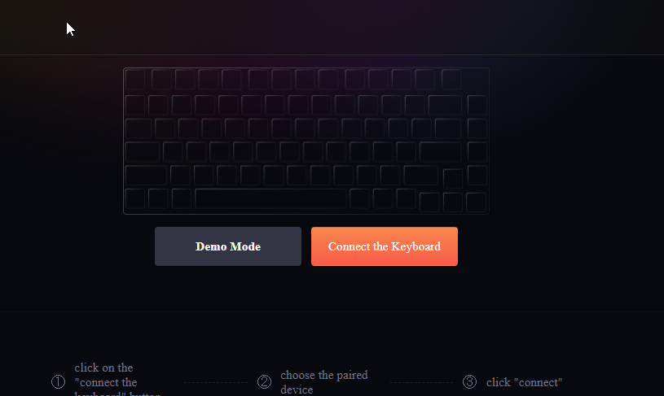
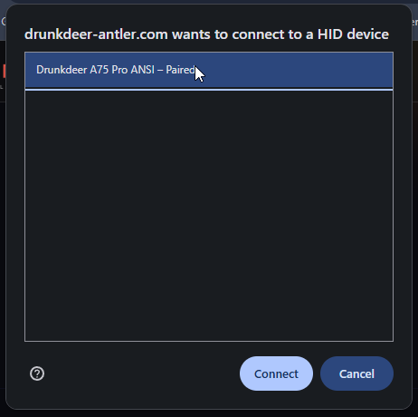
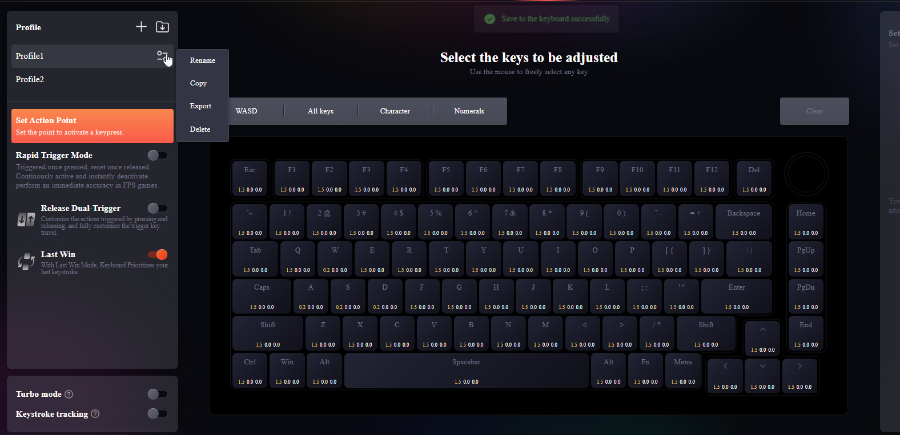
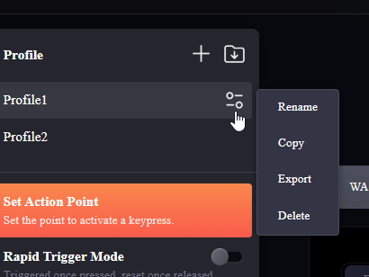

# Importing Profiles into DrunkDeer Control

Profiles are created using the **DrunkDeer web driver** at [drunkdeer-antler.com](https://drunkdeer-antler.com). Follow the steps below to configure and export a profile, then import it into this app.

---

## Step 1 — Open the web driver and connect your keyboard

Go to [drunkdeer-antler.com](https://drunkdeer-antler.com) and click **Connect the Keyboard**.

---

## Step 2 — Select your keyboard

A browser dialog will appear listing your connected DrunkDeer keyboards. Select yours and click **Connect**.

---

## Step 3 — Configure your profile

Adjust actuation points, rapid trigger, and any other settings you want. Your changes are saved to the keyboard in real time.

---

## Step 4 — Export the profile

Hover over your profile name in the sidebar, click the **settings icon**, then choose **Export**. Save the `.json` file somewhere you can find it.

---

## Step 5 — Import into DrunkDeer Control

Open **DrunkDeer Control**, click **Import Profile** in the sidebar, and select the `.json` file you just exported. Done!
