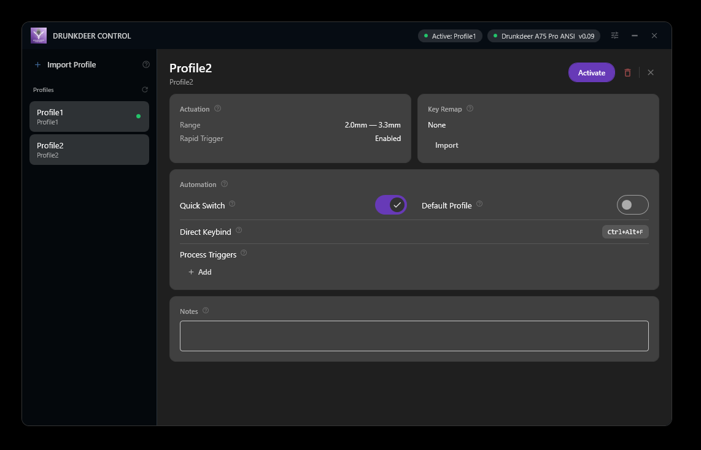
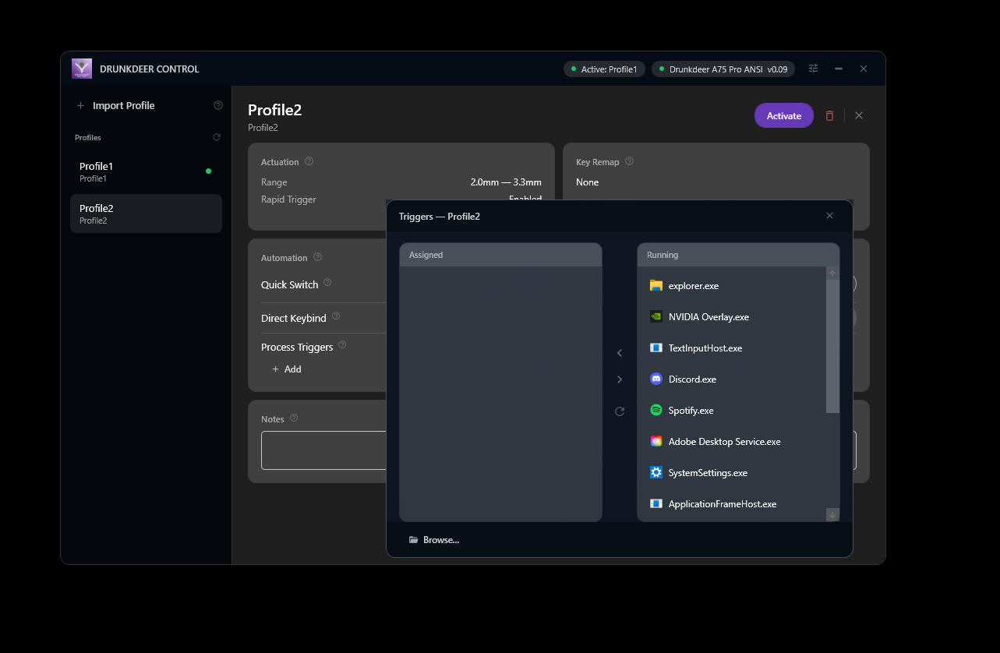
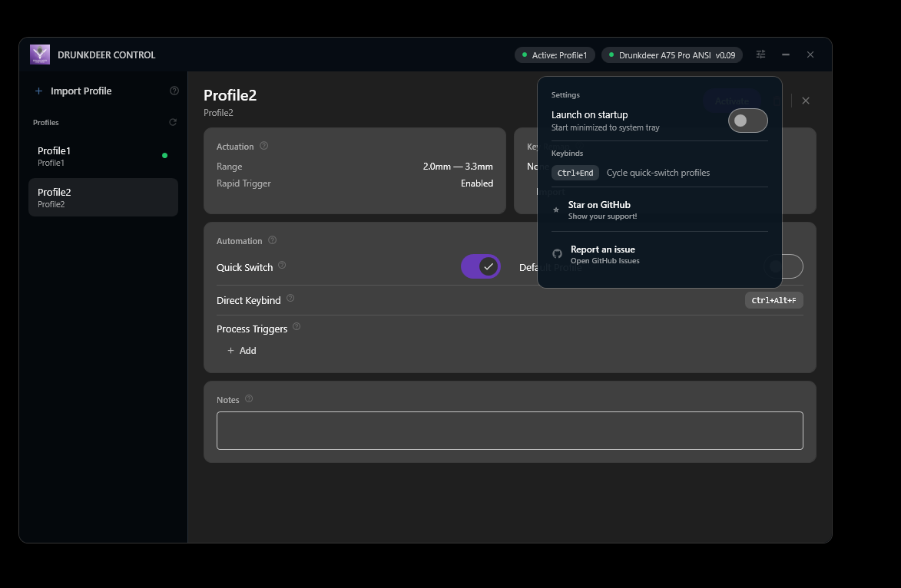
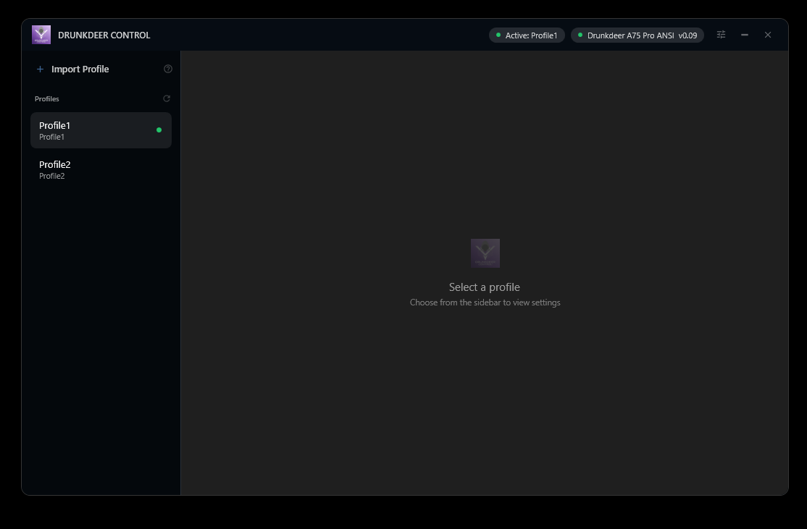

<p align="center">
  
</p>

<h1 align="center">DrunkDeer Control</h1>
<p align="center">Enhanced profile manager for DrunkDeer mechanical keyboards</p>

<p align="center">
  
  
  
</p>

> **Note:** Tested on Windows 10/11 with DrunkDeer G65 (firmware v0.48) and A75 Pro (firmware v0.09). Use at your own risk — I'm not responsible for what happens to your keyboard.

---

## What is this?

DrunkDeer Control lets you store multiple actuation profiles for your DrunkDeer keyboard and switch between them instantly — without opening the web driver. It runs in the system tray and reapplies your chosen profile whenever you need it.

Profiles are imported from the official DrunkDeer web driver export format and stored locally as JSON files.

---

## Features

### Profile Management
- Import profiles exported from the DrunkDeer web driver
- Rename and delete profiles
- Add notes to profiles for your own reference
- Profiles persist across reboots and keyboard reconnects

### Profile Switching — three ways
| Method | How |
|---|---|
| **System tray** | Right-click the deer icon → select a profile |
| **Global hotkey** | `Ctrl + End` by default (fully customizable) |
| **Process trigger** | Auto-switch when a specific app takes focus |

### Per-Profile Keybinds
Assign a direct hotkey to any profile for instant one-key switching without cycling.

### Process Triggers
Set one or more apps per profile. When that app comes to the foreground, DrunkDeer Control automatically switches to the associated profile. Great for switching actuation when you go from your desktop to a game.

> If a profile is marked as **default**, it will be applied whenever a foreground app has no associated profile. If you only want hotkey/tray switching, leave no profile set as default.

### System Tray
- Hover the tray icon to see the currently active profile
- Double-click to restore the window
- Right-click for quick profile switching

### Startup
- Optional **Start with Windows** toggle
- Supports `--start-minimized` flag to launch directly to tray

---

## Supported Keyboards

| Keyboard | Firmware | Status |
|---|---|---|
| DrunkDeer A75 Pro | v0.08–0.09 | Fully tested |
| DrunkDeer G65 | v0.48 | Fully tested |
| Other VID 0x352D keyboards | — | Should work |

Supported PIDs: `0x2383`, `0x2386`, `0x2382`, `0x2384`, `0x024f`, `0x2391`, `0x2a08`

---

## Screenshots

<p align="center">
  
</p>
<p align="center">
  
</p>
<p align="center">
  
</p>
<p align="center">
  
</p>

---

## Installation

### Option A — Download release (recommended)
1. Download the latest `.exe` from [Releases](../../releases)
2. Run it — no installer needed, no admin rights required

### Option B — Build from source
**Requirements:** .NET 8.0 SDK, Windows 10/11

```bash
git clone https://github.com/svumo/DrunkDeer-Control.git
cd DrunkDeer-Control
dotnet build DrunkDeerDriver.sln
dotnet run --project WpfApp/WpfApp.csproj
```

---

## Importing Profiles

1. Open the [DrunkDeer web driver](https://en.drunkdeer.com/pages/driver)
2. Configure your profile and export it as a JSON file
3. In DrunkDeer Control, click **Import** and select the file

---

## FAQ

**Windows Defender flags the exe as a threat**
This is a false positive common to unsigned WPF apps. The source code is fully open - feel free to audit it and build from source. If you know a fix, please open an issue.

**The app doesn't detect my keyboard**
Check Device Manager for a `VID_352D` device listed as "HID-compliant vendor-defined device". If the PID isn't in the supported list above, open an issue with the PID and keyboard model.

**Profile switching via hotkey doesn't work**
Make sure at least two profiles are marked as **Quick Switch** in their settings. The hotkey cycles only through quick-switch-enabled profiles.

**Process trigger doesn't activate**
The default profile overrides process triggers if a profile is set as default. Try un-setting the default profile if you want process-based switching to work reliably.

---

## System Requirements

- Windows 10 or 11 (64-bit)
- .NET 8.0 Runtime (bundled in the single-file release exe)
- No administrator rights required

---

## How it works

DrunkDeer keyboards don't store multiple profiles internally - only the currently active one is on the keyboard. This app writes the selected profile over USB HID each time you switch, keeping your keyboard in sync with whichever profile you've chosen.

The app writes the **default profile** on startup, then tracks the active profile from there. If you change settings in the official web driver while this app is running, it won't know - you'd need to reimport.

---

## Changelog

- **v1.1** - UI redesign & feature update
  - New dashboard UI: sidebar + detail panel layout
  - Custom global quick-switch hotkey (configurable in settings)
  - Per-profile direct keybinds
  - Profile notes field
  - Improved rename UX with inline modal
  - Active profile indicator in title bar
  - Report issue button in settings
- **v1.0** - DrunkDeer Control rebrand
  - Added A75 Pro support (PID 0x2383, 0x2a08)
  - Fixed .NET 8 compatibility
  - Added profile activation button and delete confirmation
  - Improved quick switch with helpful messages
  - Fixed tray icon double-click restore
  - Modernized JSON import (compatible with latest web driver exports)
- **v0.2** - Added support for release double trigger, last win and key remapping
- **v0.1** - Initial release: profiles and rapid trigger

---

## License

MIT — see [LICENSE](LICENSE)
