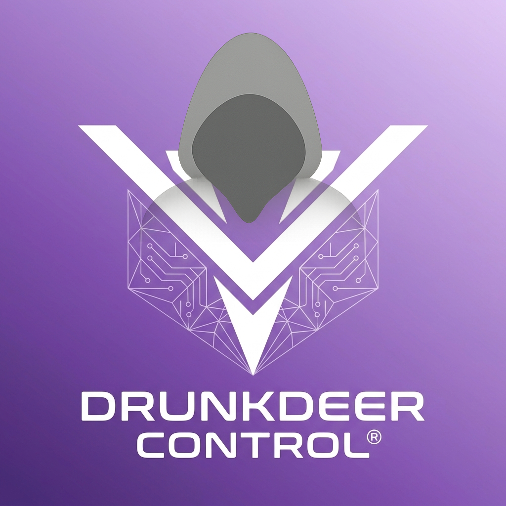
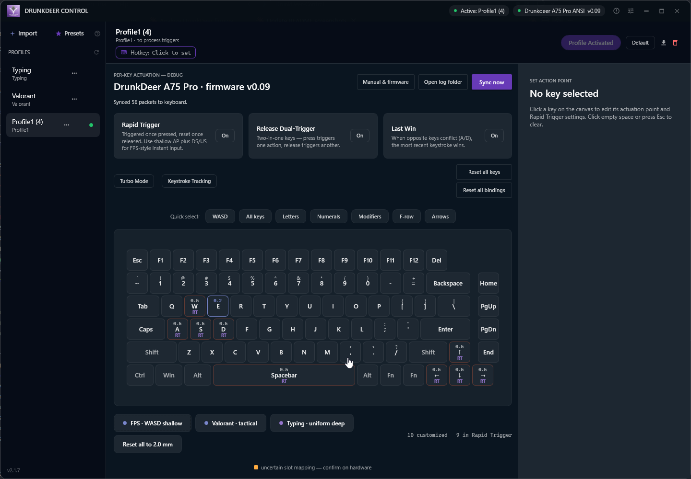
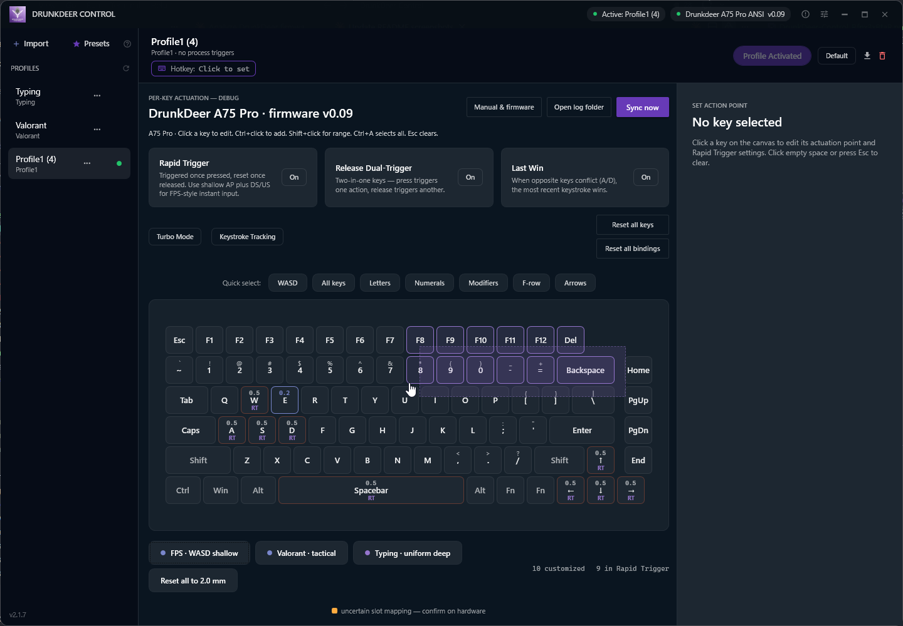
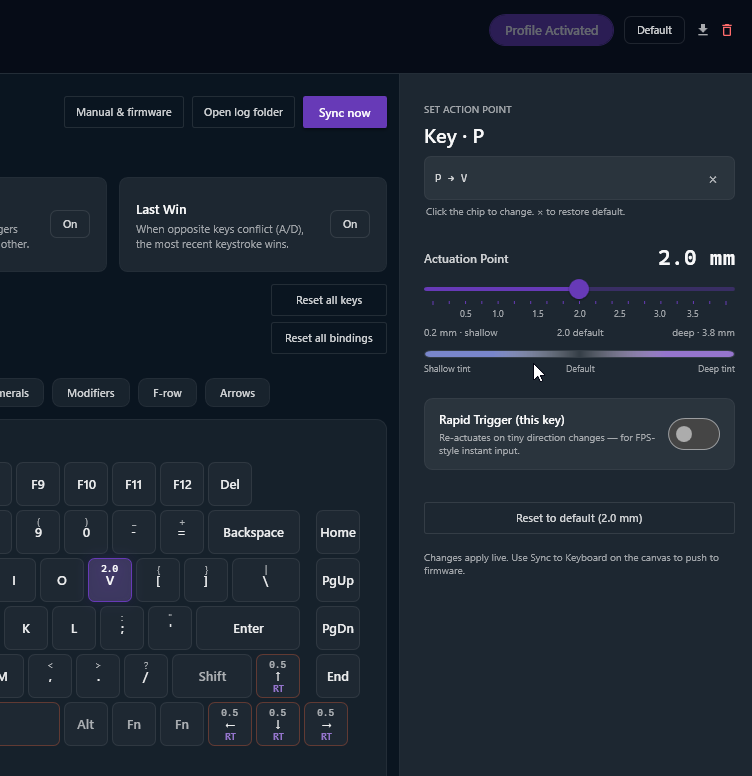
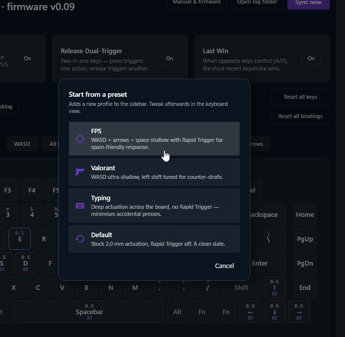
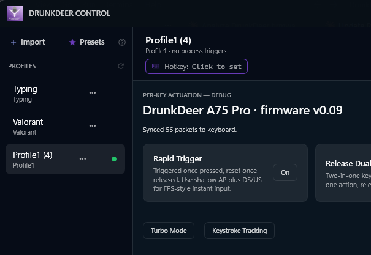

<p align="center">
  
</p>

<h1 align="center">DrunkDeer Control</h1>
<p align="center">Enhanced profile manager &amp; per-key tuning tool for DrunkDeer mechanical keyboards</p>

<p align="center">
  
  
  
  
  
</p>

> **Note:** Tested on Windows 10/11 with DrunkDeer G65 (firmware v0.48) and A75 Pro (firmware v0.08–0.09). Use at your own risk — I'm not responsible for what happens to your keyboard.

---

## What is this?

DrunkDeer Control is a free, open-source desktop app for tuning and managing your DrunkDeer keyboard — without the web driver. Adjust **per-key actuation** on a live keyboard canvas, build multiple profiles, and switch between them instantly from the tray, a hotkey, or automatically per-app.

It auto-detects your keyboard model, runs in the system tray, and keeps your keyboard in sync with whatever profile you've chosen. Profiles are stored locally as JSON and are compatible with the official DrunkDeer web driver export format.

> **New in 2.x:** a full visual keyboard view with drag-select and per-key sliders, one-click presets, key remapping, the full mode strip (Rapid Trigger / Last Win / Release Dual-Trigger / Turbo / Keystroke Tracking), live keystroke-depth visualization, multi-keyboard support, and in-app auto-update.

---

## Screenshots

<p align="center">
  
</p>
<p align="center">
  
</p>
<p align="center">
  
</p>
<p align="center">
  
</p>
<p align="center">
  
</p>

---

## Features

### Keyboard Performance View
- Full visual keyboard canvas that matches your detected model's layout
- Click a key, **drag a marquee**, or use Ctrl/Shift to multi-select
- Per-key **Actuation Point**, **Down-stroke** and **Up-stroke** sliders with millimetre tick labels
- Heat-map shading + legend so you can see your tuning at a glance
- Quick-select pills (WASD, arrows, modifiers, etc.) and one-click **presets** (FPS, Valorant, Typing)
- Live **keystroke-depth bars** on each key while keystroke tracking is on

### Mode Strip
Toggle the keyboard's global modes directly from the app:
- **Rapid Trigger** · **Release Dual-Trigger** · **Last Win** · **Turbo** · **Keystroke Tracking**
- Coupling rules are handled for you (e.g. Last Win / RDT force Rapid Trigger on and Turbo off)

### Key Remapping
Remap any key from the dedicated remap drawer; remaps are saved per profile and pushed to the keyboard on switch.

### Profile Management
- **Works out of the box** — a default profile is created automatically on first launch (no more empty-list dead end)
- Import profiles exported from the DrunkDeer web driver
- Rename, delete, and add notes to profiles
- Profiles persist across reboots and keyboard reconnects

### Profile Switching — three ways
| Method | How |
|---|---|
| **System tray** | Right-click the deer icon → select a profile |
| **Global hotkey** | `Ctrl + End` by default (fully customizable) |
| **Process trigger** | Auto-switch when a specific app takes focus |

### Per-Profile Keybinds
Assign a direct hotkey to any profile for instant one-key switching without cycling.

### Process Triggers
Set one or more apps per profile. When that app comes to the foreground, DrunkDeer Control automatically switches to the associated profile — great for going from desktop to game.

> If a profile is marked as **default**, it's applied whenever a foreground app has no associated profile. For hotkey/tray-only switching, leave no profile set as default.

### Multi-Keyboard Support
Auto-detects the connected model from its firmware type-code (falling back to USB PID) and maps profiles onto that keyboard's layout. The profile list is shared across keyboards — a profile is a "feel" you carry between boards.

### Auto-Update
The app checks GitHub for new releases and shows an in-app banner. Click **Install** and it swaps itself in place — no reinstall, no admin rights.

### System Tray & Startup
- Hover the tray icon to see the active profile; double-click to restore the window
- Optional **Start with Windows** toggle and `--start-minimized` flag

---

## Supported Keyboards

| Keyboard | Firmware | Status |
|---|---|---|
| DrunkDeer A75 Pro | v0.08–0.09 | Fully tested |
| DrunkDeer G65 | v0.48 | Fully tested |
| A75 / A75 Ultra and other VID `0x352D` models | — | Supported (19-model layout catalog) |

Supported PIDs: `0x2382`, `0x2383`, `0x2384`, `0x2386`, `0x2387`, `0x024f`, `0x2391`, `0x2a08`

> If your keyboard isn't detected, open an issue with the USB PID and model — see the FAQ below.

---

## Installation

### Option A — Download release (recommended)
1. Download the latest `.exe` from [Releases](../../releases/latest)
2. Run it — no installer, no admin rights. On first launch it installs itself to a managed location and keeps itself updated from there.

### Option B — Build from source
**Requirements:** .NET 8.0 SDK, Windows 10/11

```bash
git clone https://github.com/svumo/DrunkDeer-Control.git
cd DrunkDeer-Control
dotnet build DrunkDeerDriver.sln
dotnet run --project WpfApp/WpfApp.csproj
```

---

## Importing Profiles

1. Open the [DrunkDeer web driver](https://en.drunkdeer.com/pages/driver)
2. Configure your profile and export it as a JSON file
3. In DrunkDeer Control, click **Import** and select the file

See [Importing-Profiles.md](Importing-Profiles.md) for a step-by-step walkthrough.

---

## FAQ

**Windows Defender flags the exe as a threat**
False positive common to unsigned WPF apps. The source is fully open — audit it and build from source. If you know a fix, please open an issue.

**The app doesn't detect my keyboard**
Check Device Manager for a `VID_352D` device listed as "HID-compliant vendor-defined device". If the PID isn't in the supported list, open an issue with the PID and keyboard model.

**I just installed it and nothing I change applies to the keyboard**
Fixed in **v2.1.2** — fresh installs now auto-create a default profile. Update to the latest release.

**Profile switching via hotkey doesn't work**
Make sure at least two profiles are marked as **Quick Switch** in their settings. The hotkey cycles only through quick-switch-enabled profiles.

**Process trigger doesn't activate**
A default profile overrides process triggers. Un-set the default profile if you want process-based switching to work reliably.

**Reporting an issue — what should I attach?**
Attach `%APPDATA%\DrunkDeer Control\debug.log` (and `debug.log.old` if present). It contains the detected keyboard's model, firmware version, resolved wire-format dialect, and the per-sync packet summary — enough to diagnose most "works on A75 Pro, doesn't work on my X" reports. For wire-level detail, re-run with `--verbose-log` to capture packet hex dumps in the same log.

---

## System Requirements

- Windows 10 or 11 (64-bit)
- .NET 8.0 Runtime (bundled in the single-file release exe)
- No administrator rights required

---

## How it works

DrunkDeer keyboards don't store multiple profiles internally — only the currently active one lives on the keyboard. This app writes the selected profile over USB HID each time you switch, keeping the keyboard in sync with whichever profile you've chosen.

The freshly-created default profile is **not** pushed on first launch, so it won't overwrite whatever you've already configured on the keyboard — your first edit or profile switch is what writes to it. If you change settings in the official web driver while this app is running, it won't know — reimport to pick those up.

---

## Privacy & Network calls

DrunkDeer Control collects no usage telemetry. There is no daily ping, no opt-in dialog, no opt-out toggle, no anonymous device ID, nothing being counted. The earlier heartbeat-style telemetry was removed once it became clear that GitHub release download counts answer the "is anyone using this?" question well enough without phoning home.

The app makes exactly two outbound network calls, both unauthenticated `GET`s with no payload:

1. **GitHub releases API** — to check whether a newer release is available and show the in-app update banner. Hits `api.github.com/repos/svumo/DrunkDeer-Control/releases/latest`. See [`WpfApp/UpdateChecker.cs`](WpfApp/UpdateChecker.cs).
2. **DrunkDeer firmware-version channel** — to check whether your connected keyboard's firmware is older than the latest version DrunkDeer publishes. Hits `drunkdeer-telemetry.svumo.workers.dev/firmware`, which is a Cloudflare Worker in this repo at [`telemetry-worker/`](telemetry-worker/) (folder name kept for URL stability — the contents are now firmware-only, no stats collection). See [`WpfApp/FirmwareUpdateChecker.cs`](WpfApp/FirmwareUpdateChecker.cs).

Neither call sends any data about you, your machine, or your keyboard configuration. The firmware Worker has `[observability] enabled = false` in [`telemetry-worker/wrangler.toml`](telemetry-worker/wrangler.toml) and never reads `cf-connecting-ip`, so even the maintainer cannot see who is checking firmware versions.

---

## Changelog

- **v2.1.2** — Fresh installs auto-create a default profile (the app is usable immediately instead of silently discarding every change)
- **v2.1.1** — Robustness fixes
- **v2.1.0** — Multi-keyboard support (19-model layout catalog), full keyboard performance view, live keystroke-tracking depth bars, performance pass
- **v2.0** — Keyboard view rebuild: visual keyboard canvas, drag-marquee multi-select, per-key Actuation/Down-stroke/Up-stroke drawer, presets, key-remap drawer, mode strip
- **v1.3–v1.6** — In-app auto-update (in-process swap), canonical install + redirect, firmware-version telemetry & update banner, single-instance handling
- **v1.1–v1.2** — Dashboard UI redesign (sidebar + detail panel), custom global hotkey, per-profile keybinds, profile notes, inline rename
- **v1.0** — DrunkDeer Control rebrand: A75 Pro support, .NET 8 compatibility, modernized JSON import
- **v0.2** — Release double trigger, last win, key remapping
- **v0.1** — Initial release: profiles and rapid trigger

---

## License

MIT — see [LICENSE](LICENSE)
